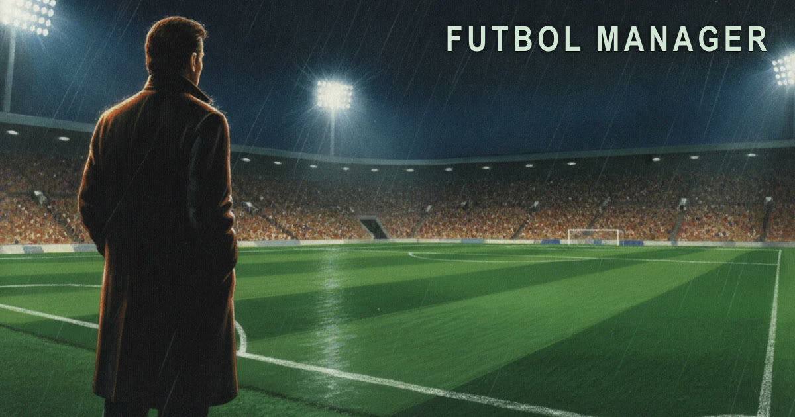

# Futbol Manager

[](https://github.com/pearpages/futbol-manager/actions/workflows/ci.yml)
[](https://futbol.pearpages.com)
[](LICENSE)

[](https://futbol.pearpages.com)

A football management game for the browser, in the style of Dinamic's PC Fútbol 5.0
(1996/97).

You take charge of a first-division club, pick the eleven and the system, buy and sell in the
transfer windows, set ticket prices, expand the stadium and keep the board happy. Matches are
worked out statistically, not animated. The game is fictional by default: clubs are named after
their cities, and it ships in Catalan, Spanish and English.

**Play it:** <https://futbol.pearpages.com>. Careers are saved in your browser and nothing
leaves your device.

## What's new

**v0.8.1 — fixes.** Offers for your players end when the transfer window closes and come
only from clubs that can pay. A damaged save no longer breaks the game: it is refused, or the
game offers to delete it. The table's matchday now matches the one on Avui. Every release, with its notes, is on the
[releases page](https://github.com/pearpages/futbol-manager/releases).

What comes next is in [docs/roadmap.md](docs/roadmap.md): sponsorship deals (M5c), then
injuries, form and training (M6).

## Install

Requires [mise](https://mise.jdx.dev), which pins Node 24.16.0 and pnpm 11.15.0.

```sh
mise trust && mise install && pnpm install
```

## Usage

```sh
pnpm dev               # the game on a local dev server
pnpm storybook         # every screen at phone, tablet and desk width
pnpm test -- --run     # the full test suite, once
pnpm season 42         # simulate a season headless and print the final table
pnpm build             # the game into packages/app/dist (and the design system's bundle)
```

## Documentation

- [docs/roadmap.md](docs/roadmap.md): milestones, what is built and what comes next
- [architecture.md](architecture.md): how the game is put together
- [docs/attribute-model.md](docs/attribute-model.md) and [docs/market-model.md](docs/market-model.md):
  how players are rated and valued
- [decisions.md](decisions.md): why things are the way they are

Contributors and agents start at [AGENTS.md](AGENTS.md).

## Contributing

This is a personal project and it doesn't take contributions. Pull requests will be closed
without review. To report a security problem, see [security.md](security.md).

## License

Proprietary, all rights reserved. The source is published for viewing only. See [LICENSE](LICENSE).
