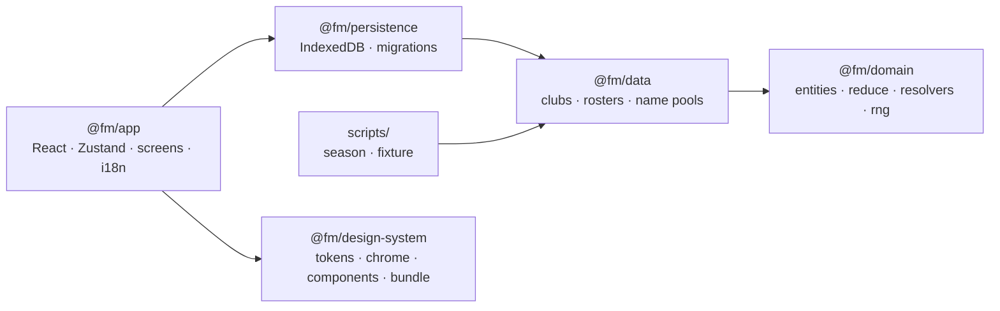

# Architecture

How Futbol Manager is built. It explains _how_ things work. The rules that follow from it are
in [principles.md](principles.md), the reasons for each choice in
[decisions.md](decisions.md), the security surface in [security.md](security.md), and open
work in [tasks.md](tasks.md). When code and this file disagree, the code is right and this
file is a bug.

The model's own specs live beside it: [docs/attribute-model.md](docs/attribute-model.md) (players
and team ratings), [docs/market-model.md](docs/market-model.md) (valuation, windows, money) and
[docs/roadmap.md](docs/roadmap.md) (milestones).

## Shape

A single-page browser game in TypeScript 6 and React 19, built with Vite 8 into static files
and served from GitHub Pages at `futbol.pearpages.com`. There is no backend: the whole game
runs in the tab, and saves go to the browser's IndexedDB. The repo is a pnpm workspace of five
packages. Two Node scripts run the same domain code headless.

## Modules

| Path                      | Owns                                                                                                                                                                                                                                                                                                                                                                                                         |
| ------------------------- | ------------------------------------------------------------------------------------------------------------------------------------------------------------------------------------------------------------------------------------------------------------------------------------------------------------------------------------------------------------------------------------------------------------ |
| `packages/domain/`        | Pure TS, no dependencies. Entities, `reduce`, the day tick, fixtures and tables, the Poisson result resolver, lineups and team ratings, the market (`needFor`, bids, windows), finance (ledger, gate, TV, sponsorship, debt), the board, the season rollover, `time.ts` (`DayNumber`) and `rng.ts` (`sfc32`, `hashSeed`). The `*.harness.test.ts` files simulate many seasons and assert distribution bands. |
| `packages/data/`          | Adapters from raw data to domain entities: the 25 domestic clubs (city names, real capacities, ratings derived from squad value), real-shaped rosters with altered surnames, 32 foreign clubs, and the name pools. The formation harness lives here because it needs the shipped rosters.                                                                                                                    |
| `packages/persistence/`   | Save/load to IndexedDB (`saves` holds envelopes, `slots` holds ~200 B summaries), JSON export/import, and the forward-only migration chain with committed `fixtures/v*.json`.                                                                                                                                                                                                                                |
| `packages/app/`           | React screens (one per hub tile), the Zustand store, `i18n/` (ca/es/en dictionaries, `useT`, formatters), `styles/` (app-only art and shell stylesheets; the tokens, reset, chrome and shared components come from `@fm/design-system`), drawn-in-code art (badges, radar, pitch, tile icons) and generated rasters under `public/art/`.                                                                     |
| `packages/design-system/` | The game's look, shared by the app and the Claude Design System artifact (ADR 0014): tokens, the reset and chrome stylesheets, shared components, brand assets and a README. Imports no package of ours. The app consumes it from source; `pnpm build` also produces `dist/bundle.js` (IIFE, React inlined), `bundle.css` and `index.d.ts` for the artifact (ADRs 0015, 0016).                               |
| `scripts/`                | `season.ts` (headless season, prints the table) and `fixture.ts` (writes a save fixture for the current schema). Run by Node with native type stripping.                                                                                                                                                                                                                                                     |
| `tests/`                  | Repo-level tests, e.g. `boundaries.test.ts`, which checks the ESLint boundary rules really fire.                                                                                                                                                                                                                                                                                                             |
| `docs/`                   | Roadmap, stack, model specs and `adr/`.                                                                                                                                                                                                                                                                                                                                                                      |
| `assets/`                 | Local PC Fútbol reference screenshots. Gitignored except its README.                                                                                                                                                                                                                                                                                                                                         |

## Data flow

1. **Start.** The landing screen offers Continue, Load or New career. The store's `entry` and
   `needsSetup` fields track where the player is. `restore()` follows `fm.lastSlot` from
   `localStorage` and loads that save through the migration chain.
2. **Commands.** A screen dispatches a command. The store calls `reduce(state, command, rng)`,
   which validates it (throwing a coded `GameError` on a refusal), returns the new
   `GameState` plus a list of `Event`s, and advances the serialised PRNG state. Lineups and
   tactics are accepted only for the managed club, and only in a listed formation.
   A signing re-checks that the seller can still spare the player when the contract is agreed,
   not only when the bid was made.
3. **The tick.** `AdvanceDay` is the pipeline, and it is refused once the last matchday is
   played (so is `StartNewSeason` for a sacked manager): it plays fixtures that are due, settles money
   on the 1st of each month, resolves bids, generates AI offers weekly while a window is open,
   and emits window, contract and board events. `StartNewSeason` runs `rolloverSeason`
   (prize money, ageing, retirement, contract expiry, youth top-up, a fresh fixture list
   seeded from the year, `history` archive) and then the AI summer window.
4. **Rendering.** Screens read `GameState` for facts. `notifications.ts` turns events into
   translated sentences for the hub's news, the feed is capped at 60 and persisted with the
   save. Presentation-only state (screen, tabs, the language in `localStorage`) never enters
   `GameState`.
5. **Saving.** The player saves named slots. An envelope holds `schemaVersion`, the game, the
   rng state and the feed.

Everything in steps 2–3 is pure and reproducible from `(seed, commands)`, which is what lets
`simulateSeasons` / `simulateCareer` and `pnpm season` drive the exact code the UI does.

## Build, test, deploy

- **Toolchain:** mise pins Node 24.16.0 and pnpm 11.15.0. Versions are listed in
  [docs/stack.md](docs/stack.md).
- **Tests:** Vitest 4 with one project per package. `domain` runs unit tests plus multi-season
  harnesses (30 s timeout). `app` runs Testing Library on jsdom with `css: false`, fake
  IndexedDB and English pinned (15 s timeout). Layout is checked in a real browser, not the suite.
- **Lint/format:** ESLint 10 (boundary and determinism rules) and Prettier.
- **CI** (`.github/workflows/ci.yml`): on push to `main`, on PRs, or on manual dispatch, the
  `check` job runs lint → typecheck → test → format:check → build. On `main` only, a `deploy`
  job uploads `packages/app/dist` and publishes it with `actions/deploy-pages`.
- **Hosting:** GitHub Pages (Actions source), custom domain `futbol.pearpages.com`, kept by
  `packages/app/public/CNAME`. Because the site is served from a domain root, Vite's `base` is
  `/` and root-absolute asset paths work. The build embeds the short commit hash as
  `VITE_COMMIT` for the footer. `index.html` carries static Open Graph tags and `og.jpg`, plus the favicon (`favicon.svg`, with `favicon.ico` and `apple-touch-icon.png` rendered from it).
